<!-- _paginate: skip -->
# NLP data visualization project

*...from experimentation to the beginning of my self-discovery & NLP-discovery*

**13.08.2025**

---
## 🧐 background story

- **General Linguistics** (Obecná Lingvistika) & **Digital Humanities**

- **natural language processing** (zpracování přirozeného jazyka) (NLP)

- My **Github** Profile: https://github.com/kivanc57

---
## 👀 about me


- linguist & programmer
- MA student @ UPOL
- former 42 Prague student
- combat sports enthusiast
- polyglot
- i use Arch, btw

---
## 🗃️ about project(-s)
- part 1 **(spacy)** ➜ [Github repo](https://github.com/kivanc57/nlp_data_visualization) & [doc](https://spacy.io/api/doc)

- part 2 **(nltk)** ➜ [Github repo](https://github.com/kivanc57/nlp_data_visualization) & [book](https://www.nltk.org/book/)

- **gradual evolution**
basic linguistic analysis ➜ various file handlings ➜ data visualization ➜ `nltk` (comparison with other library) & academic report ➜ Marp presentation ➜ `Dockerfile` & `docker-compose` ➜ Github Actions `pipeline`

- **final project(-s)** zápočet(-y)

- **datasets** ➜ large, various, traditional, extracted from real-life situations and *Kaggle* (enron, reuters, COSMIC-2 Data, Faust...).

---
<!-- _paginate: skip -->
# spaCy project

---

## project structure

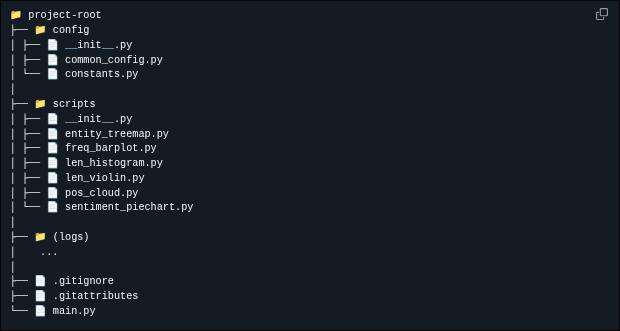

---

## script structure

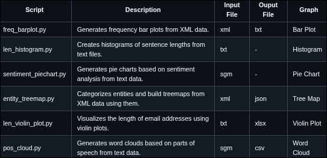

---

**`config/common_config.py`**

``` python
import logging
from os.path import dirname, abspath, join, basename
from os import makedirs

#Create separate log for each file with its name 
def get_log_path(script_name, log_folder='logs'):
    project_path = dirname(dirname(abspath(__file__)))
    log_folder_path = join(project_path, log_folder)
    makedirs(log_folder_path, exist_ok=True) #Create the folder if does not exist
    log_file_name = f"{script_name}.log"
    full_path = join(log_folder_path, log_file_name)
    return full_path

#Configures logging in each script
def configure_logging(script_name):
        log_file = get_log_path(script_name)
        logging.basicConfig(
        level=logging.INFO,
        format='%(asctime)s %(name)s %(levelname)s %(message)s',
        handlers=[
            logging.FileHandler(log_file, mode='a'),
            logging.StreamHandler()
        ],
    )

#Adjust this os function in each function to find inpput and output paths
def get_join_path(folder_name, file_name, is_sample=False):
    try:
        project_path = dirname(dirname(abspath(__file__)))
        if is_sample:
            folder_path = join('data', folder_name, 'sample')
        else:
            folder_path = join('data', folder_name)
        full_path = join(project_path, folder_path, file_name)
        return full_path
    
    except Exception as e:
        print(f"Error: {e} joining {folder_name} and {file_name}")

```

---
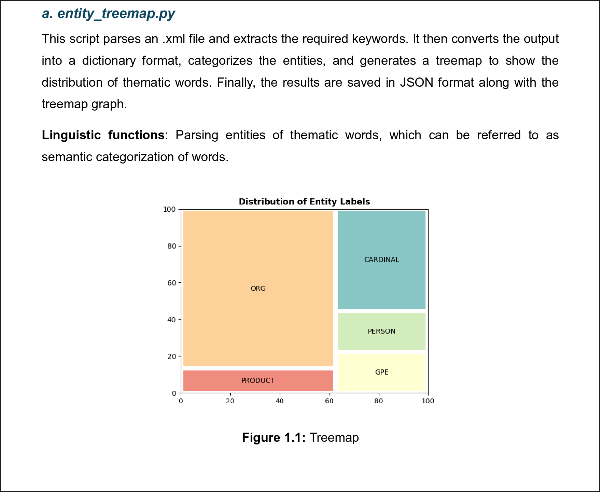

---
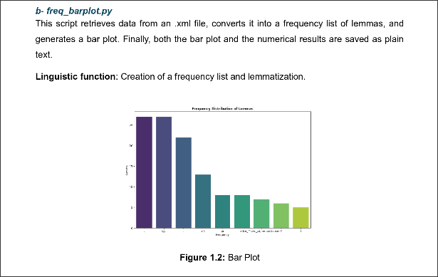

---
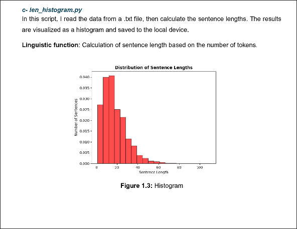

---

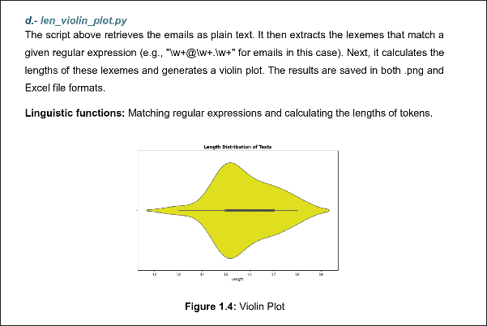

---

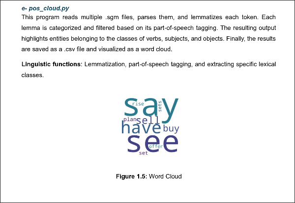

---

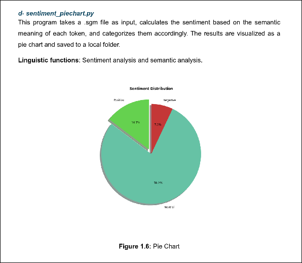

---

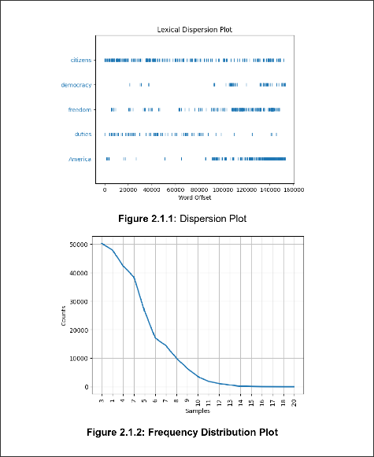
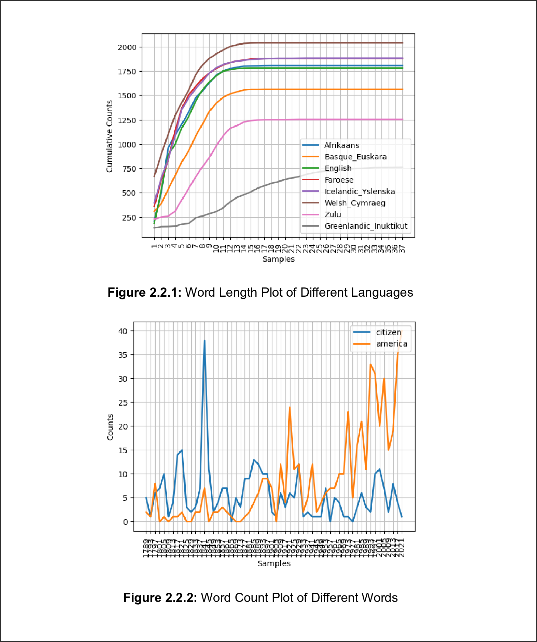
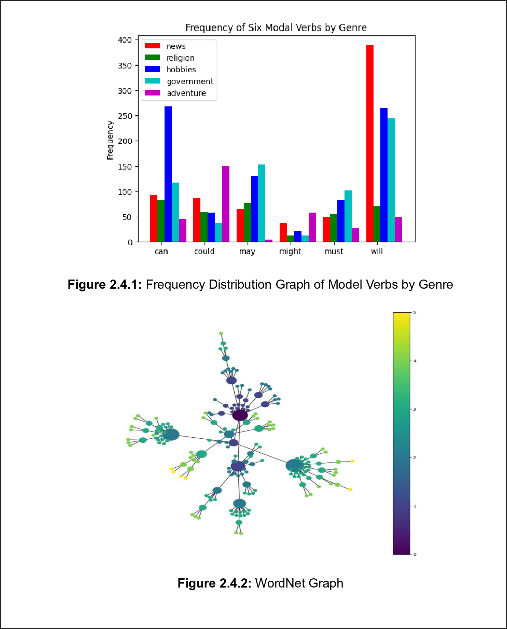


---

<!-- _paginate: skip -->
# spaCy & nltk

---
## 🚀 tech stack
<div class="columns">
<div>

### part 1 - spaCy
***vscode***, **os**, **re**, **dotenv**, **bs4**, **xml**, **pandas**, **spacy**
csv, json, logging, seaborn, squarify, matplotlib, wordcloud, textblob

</div>
<div>

### part 2 - nltk
***jupyter notebook***, nltk, re, xml, bs4, urllib, pickle, collections, matplotlib, numpy

</div>
</div>

---

## 🔥 nltk vs nlp
<div class="columns">
<div>

### nlp
- industry standard
- newer, robust and *deep learning* accompanied
- fast & efficient
- easy-to-learn
- general purposes

</div>
<div>

### nltk
- academy standard
- old-school, however has *machine learning*
- slower
- steeper learning curve
- tailored for *linguistic analysis*

</div>
</div>


---
<!-- _paginate: skip -->
## what did i learn?


---
- reading & searching by **documentation**

- **the longest journey:** the entire process took me months 

- **self-reliance** & **self-confidence**

- **scalability** concerns for big data

- **hands-on experience** with multiple data science, utility, file libraries, some **CI/CD** tools & a few **IDEs**

- **observation** of main NLP libraries' comparison

- **12.12.2025:** neovim python setup + Marp documentation

- **13.12.2025:** Dockerfile, docker-compose.yml and Github Actions

- **credits** 🤗

---

## technical volume vs. complexity
<!-- _paginate: skip -->


---

- **dilemma**

- one of a kind and **first stand-alone project**

- tiny **technical details**

- **real value** because of previously mentioned points

- fast-paced learning in **last two days(!?)**

---
<!-- _paginate: skip -->
## 💼🤝 let's connect!


📩 kivancgordu@hotmail.com
